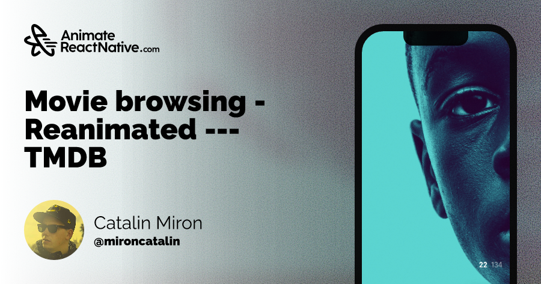

  <a href="https://www.animatereactnative.com">
    <picture>
      <source media="(prefers-color-scheme: dark)" srcset="https://www.animatereactnative.com/animatereactnative_dark.svg">
      
    </picture>
  </a>
  

  <code>AnimateReactNative.com - Premium and Custom React Native animations</code>
  
For more information, visit: <b>https://www.animatereactnative.com</b>

  

### React Native Movies Animation

This is an App that we're building while live streaming on YouTube.
This is a React Native application, build using Expo and the below packages.

### Stack

- `TMDB` - for the movie database API
- `@tanstack/react-query` + `axios` - for fetching movies
- `@legendapp/state` - for state management (reactive)
- `react-native-reanimated` + `moti` - for animations
- `@expo/vector-icons` - for icons

### Inspiration

https://dribbble.com/shots/4946521-Movie-Browsing by [Goran Vujakovic](https://dribbble.com/goranvujakovic)

### You can find me on:

- Github: http://github.com/catalinmiron
- Twitter: http://twitter.com/mironcatalin
